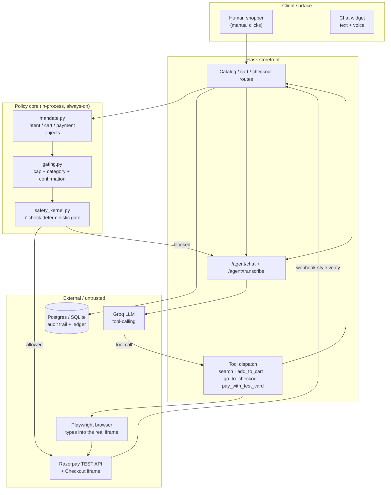
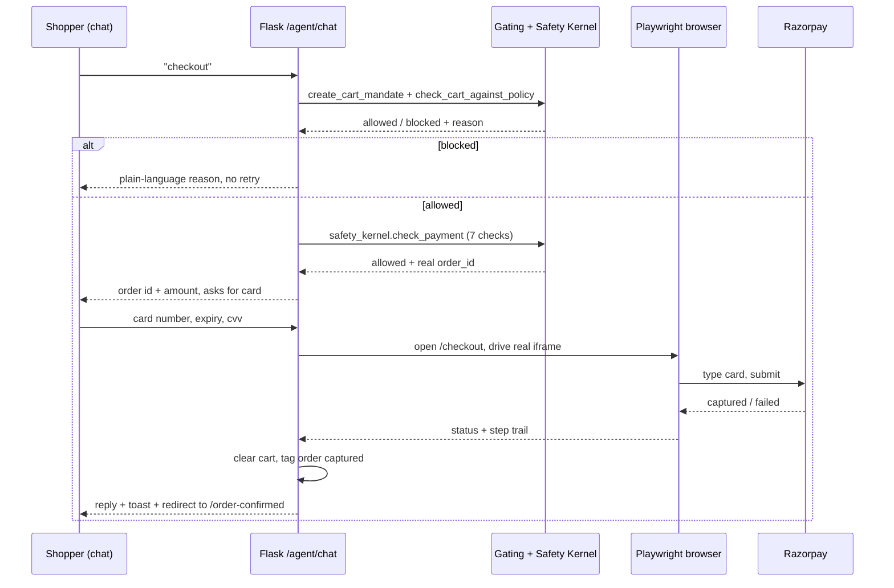

# CartMind — Agentic Commerce Reference Architecture

**Design Document · Internal**

A gated, auditable payment pipeline for an AI shopping agent — system architecture, low-level flows, security model, known limitations, and business impact.

| | |
|---|---|
| **Status** | Demo / Reference build |
| **Owner** | Storefront & Agent Platform |
| **Scope** | Storefront · Chat agent · Payment gating |
| **Mode** | Razorpay TEST MODE only |

## Contents

1. [Purpose & Problem](#01--purpose--problem-statement)
2. [High-Level Design](#02--high-level-design)
3. [Low-Level Design](#03--low-level-design)
4. [Data Model](#04--data-model)
5. [Security Model](#05--security-model)
6. [Limitations](#06--limitations)
7. [Impact](#07--impact)
8. [Hardening Roadmap](#08--hardening-roadmap)

---

## 01 — Purpose & Problem Statement

Agentic commerce needs a demonstrable answer to one question: can an AI be trusted to spend money on a person's behalf, and can every decision it made be reconstructed afterward?

- Conversational commerce is moving from "recommend" to "transact" — an agent that can search, decide, and pay changes the trust surface of a storefront.
- CartMind is a reference implementation of the guardrails that make that surface acceptable: hard spend caps, category blocks, explicit confirmation, and a seven-check gate in front of every money-moving write.
- It exists to answer three questions concretely, not hypothetically: what can the agent do unsupervised, what can it never do, and how would an auditor prove that after the fact.
- The build borrows AP2's separation of intent / cart / payment mandates, simplified to plain structured objects for a demo rather than signed verifiable credentials.

## 02 — High-Level Design

Three planes: a storefront the agent and a human share, a policy core neither can bypass, and an external payment rail treated as untrusted until verified.

*Fig. 1 — Component view. The policy core sits between every route and Razorpay; the agent has no path that skips it.*

### Design decisions

- **Single storefront, two front doors.** A human clicking buttons and an LLM calling tools both terminate in the same Flask routes and the same gating code — there is deliberately no separate "agent API" with looser rules.
- **The LLM never touches money directly.** It can only request a named tool call; the server decides whether that call is allowed to run, independent of what the model claims.
- **Payment automation is a browser, not an API shortcut.** Razorpay's card fields live in a cross-origin iframe by design (PCI scope); the agent drives a real Playwright browser rather than being handed a way around that isolation.
- **Every checkout is channel-tagged** (`manual` / `agent`) at creation time, so the owner console's split is measured, not inferred.

## 03 — Low-Level Design

### 3.1 — Conversational tool loop

Each chat turn runs a bounded loop (max 4 rounds) against the LLM with a fixed tool schema. The model chooses zero or more tools per round; the server executes them and feeds results back before the next round.

- `search_catalog` → free-text + color/type/price filter over the in-memory catalog.
- `view_product` → forces a product-page view before `add_to_cart`, mirroring real shopper behavior.
- `go_to_checkout` → runs the full gate (below) and returns `blocked`/`allowed` plus the real order id — never a guess.
- `pay_with_test_card` → the only tool that can move money; requires card details already present in the conversation, never silently defaulted.

> **Reliability note** — Smaller/rate-limited models occasionally narrate a fake success without calling the payment tool. The server treats the model as untrusted here too: a regex detects card-like input or a bare confirmation after a proposed card, forces `tool_choice` to the payment tool, and overwrites any reply claiming success if the tool was never actually invoked that turn.

### 3.2 — Checkout → payment sequence

*Fig. 2 — A blocked cart never reaches Razorpay; a captured payment always reuses the order id already shown to the user.*

### 3.3 — Order-identity guarantee

An earlier revision created a fresh Razorpay order on every `/checkout` load, including the automation's own internal reload before typing the card — so the order id shown to the shopper could silently diverge from the one actually charged. Fixed by reusing any existing `status="created"` order for the same user + amount, refreshing its stored item snapshot on reuse so catalog changes (e.g. images) don't freeze stale.

### 3.4 — Local vs. hosted automation

| Environment | Browser strategy | Visible to user? |
|---|---|---|
| Local dev | Attaches over CDP to the developer's own Chrome (`--remote-debugging-port`); falls back to a fresh maximized window | Yes — card types live on screen |
| Hosted (Render / cloud) | Always launches its own headless Chromium (detected via `RENDER` env var) | No — same real capture, no display to draw on |

## 04 — Data Model

One append-friendly events table for narration, one payments table as the ledger of record.

| Table | Key columns | Purpose |
|---|---|---|
| `audit_events` | `event_type, action, status, amount_inr, details_json` | Timestamped narration of every gate decision — allowed or blocked, with the plain-English reason |
| `payments` | `order_id, status, amount_inr, channel, transaction_id, user_id` | Ledger of record; `status` transitions created → captured/failed; `channel` is manual/agent |
| `users` | `email, password_hash, name` | Includes an auto-provisioned guest account so checkout never hard-requires signup |

Postgres (Neon) in production, SQLite locally, selected purely by whether `DATABASE_URL` is set — no code branches on environment beyond that.

## 05 — Security Model

> **Enforced today**
> - **Iframe isolation is load-bearing, not incidental.** Razorpay's card fields are never reachable from page or agent JavaScript — the only way to fill them is real OS-level input via Playwright, which is also why a card can never be silently auto-submitted by a hallucinating model without a real browser action happening.
> - **Two independent gates, not one.** `gating.py`'s cart-level policy and `safety_kernel.py`'s seven-check payment gate are separate code paths; a bug in one doesn't disable the other.
> - **Seven checks, each falsifiable in isolation:** authorization match, recalculated-amount match, transaction limit, quantity limit, discount limit, rate limit, duplicate-payment check — every pass/fail carries a plain-English reason into the audit trail.
> - **No implicit spend.** `pay_with_test_card` requires card details already present in the conversation this turn; the system prompt and a server-side forced-tool-call check both refuse to default to a stored card silently.
> - **TEST MODE is structurally enforced.** `razorpay_service.py` rejects `rzp_live_` keys outright — there is no code path in this repo that can move real money.

### Threat notes specific to an LLM-driven checkout

- **Prompt injection via product data.** Catalog text (names, descriptions) flows into the model's context; nothing in it is currently sanitized against instruction-like content. Low blast radius today because the model still can't call the payment tool without a real card appearing in the conversation.
- **Model narration vs. ground truth.** The model's own claims are never trusted for anything money-related — the server verifies tool calls happened and reads results from real HTTP responses, not from the model's prose.
- **Session-cookie handoff to automation.** The Playwright browser is handed the requester's session cookie so it acts as that user; this is safe within a single trusted server process but would need scoping (short-lived, single-use tokens) before this pattern is exposed multi-tenant.

## 06 — Limitations

> **Known, accepted for a demo**
> - **External-service latency is unbudgeted risk.** A single `/checkout` load has been observed taking 15-20s (sequential Postgres round-trips + a live Razorpay order call); the full pay flow can run 50-90s. Timeouts are widened to absorb this, not to fix its cause.
> - **No connection pooling.** `database.py` opens a fresh Postgres connection per call; every extra audit-event write is another network round trip.
> - **Small/rate-limited LLMs are measurably less reliable** at the multi-step tool sequence checkout requires — mitigated with forced tool-choice and reply-overriding safeguards, not eliminated.
> - **The "type into a visible browser" experience is local-only** by construction — CDP-attach to a developer's own Chrome has no cloud equivalent; hosted deployments fall back to headless with identical results but no visible typing.
> - **No rate limiting or bot defense** on `/agent/chat` itself — the seven-check gate limits blast radius per transaction, not request volume.
> - **Guest-account checkout** means auditability is per-session, not per-verified-identity — acceptable for a demo, not for a real deployment.

## 07 — Impact

> **What this demonstrates**
> - **A concrete trust boundary for agentic spend.** Rather than arguing in the abstract that an AI agent "can be made safe," CartMind shows the exact mechanism: a deterministic, falsifiable gate the agent cannot talk its way around.
> - **Auditability as a first-class output, not an afterthought.** Every blocked attempt and every captured payment is reconstructable from `/trail` and the owner console — the same data a real compliance review would ask for.
> - **A reusable pattern, not a one-off script.** The gating/kernel/mandate split is portable to any storefront; the browser-automation layer is portable to any PCI-scoped checkout that similarly isolates card entry in an iframe.
> - **Operational visibility a business would actually use.** The owner console's manual-vs-agent split, funnel, and blocked-attempt ledger turn "is the agent behaving" from a qualitative worry into three numbers on a dashboard.

| Metric surfaced | Where | Why it matters |
|---|---|---|
| Checkout funnel (attempts → cart-policy → kernel → captured) | Owner console | Shows exactly which gate is rejecting traffic, not just a pass/fail total |
| Manual vs. agent capture rate | Owner console | Confirms the agent is held to the same bar as a human, not a looser one |
| Blocked-attempt ledger with reason | Owner console + `/trail` | Turns "the agent tried something risky" into a reviewable, timestamped record |

## 08 — Hardening Roadmap

In priority order, if this moved from demo toward production:

1. Connection pooling for the audit/payments database — removes the single largest source of unbudgeted latency.
2. Real user authentication in place of guest-account checkout, so audit records tie to a verified identity.
3. Sanitize catalog text reaching the LLM's context; treat product data as untrusted input, not trusted system content.
4. Short-lived, single-purpose session tokens for the automation handoff, scoped narrower than the user's full session cookie.
5. Rate limiting and anomaly detection on `/agent/chat` independent of the per-transaction safety kernel.

---

*CartMind — Design Document · Razorpay TEST MODE only · No path in this repository can move real money*
