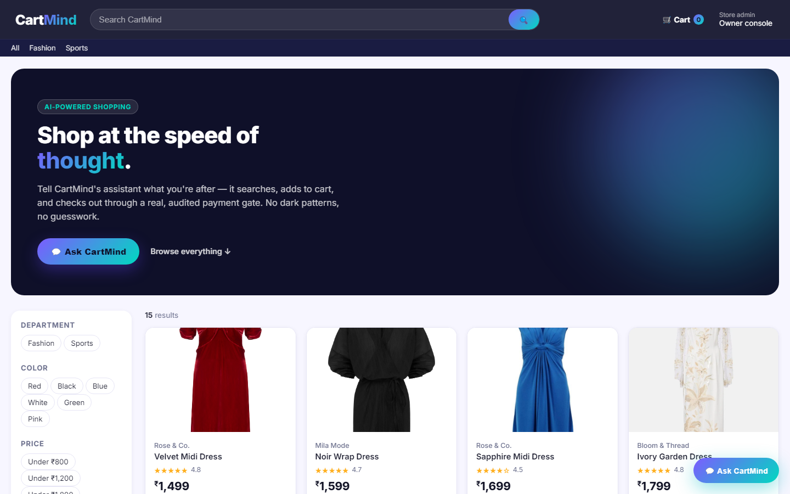
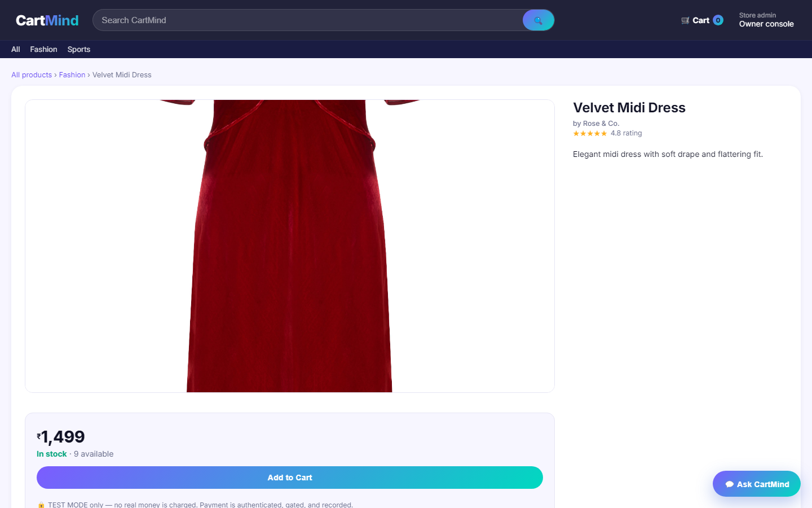
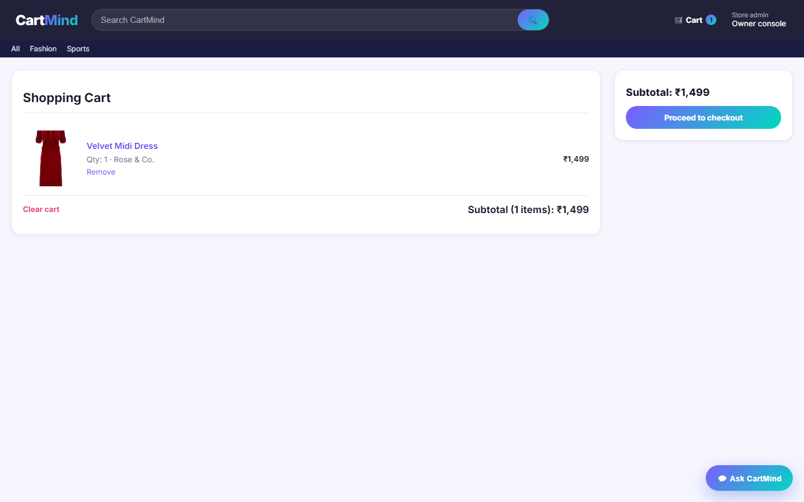
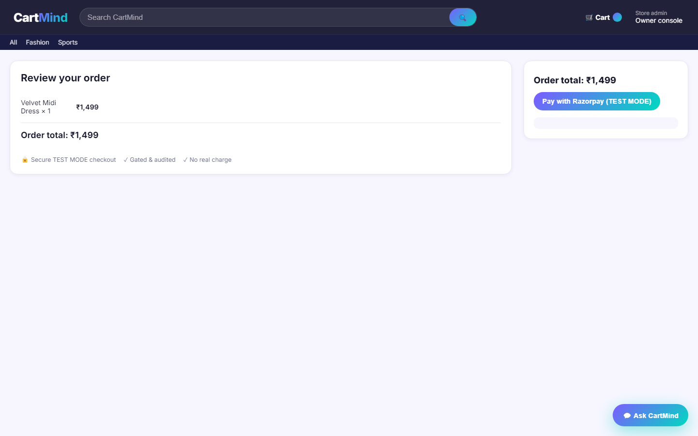
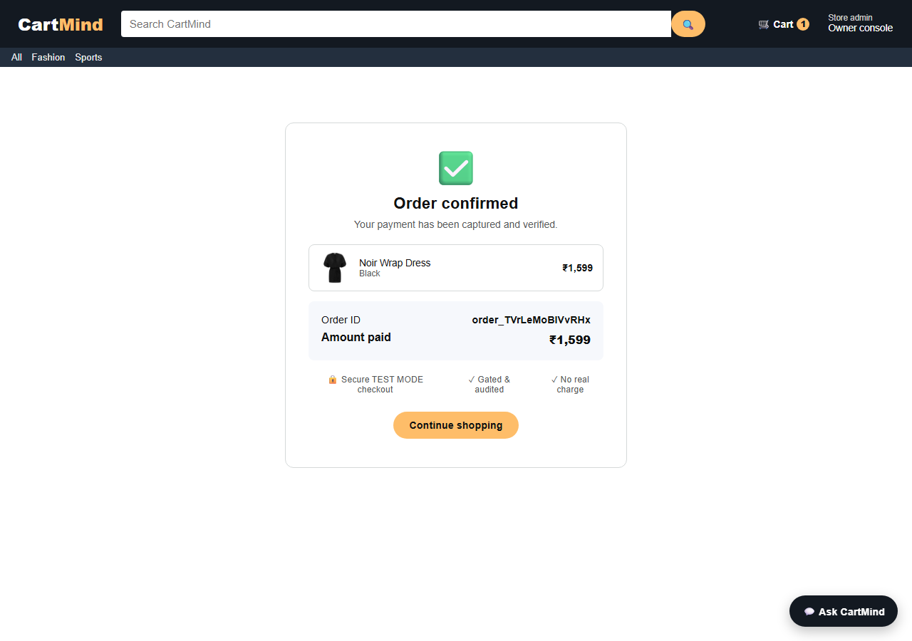
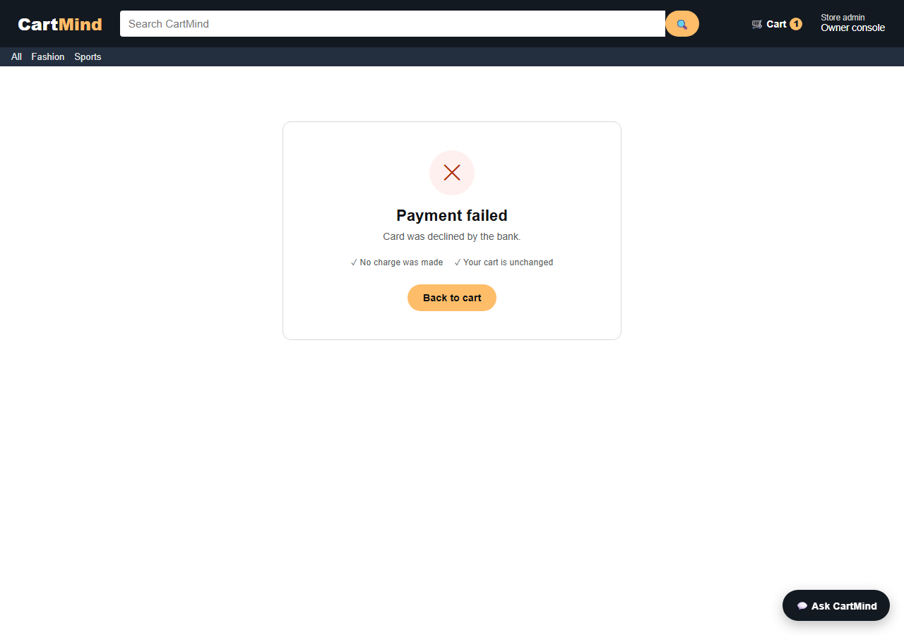
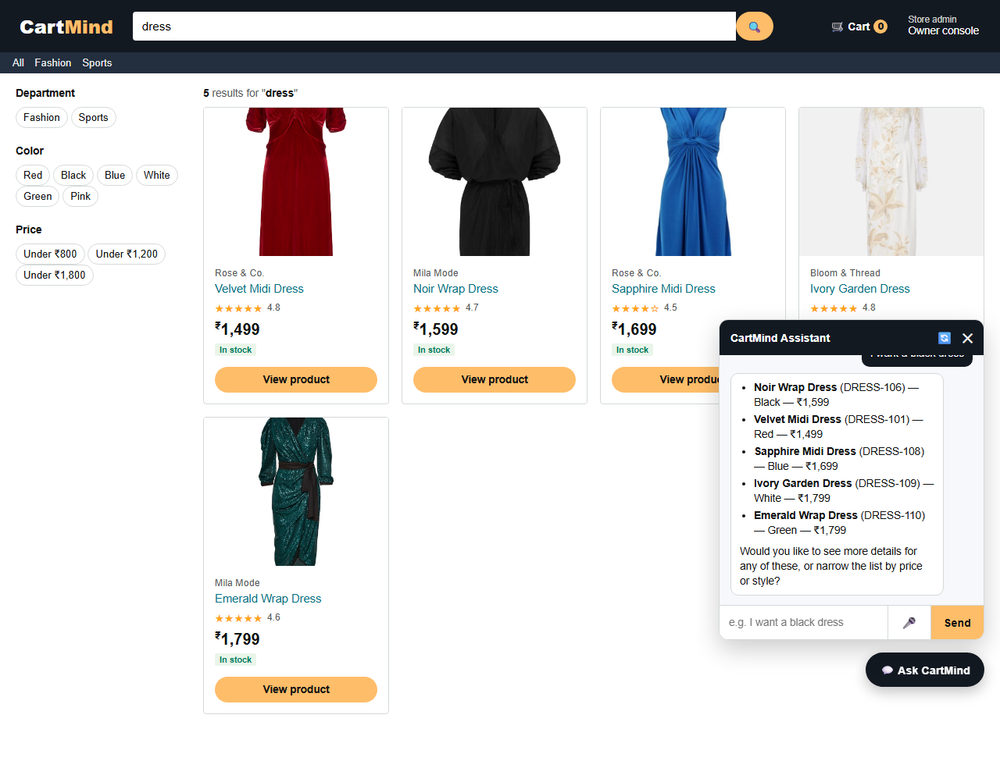
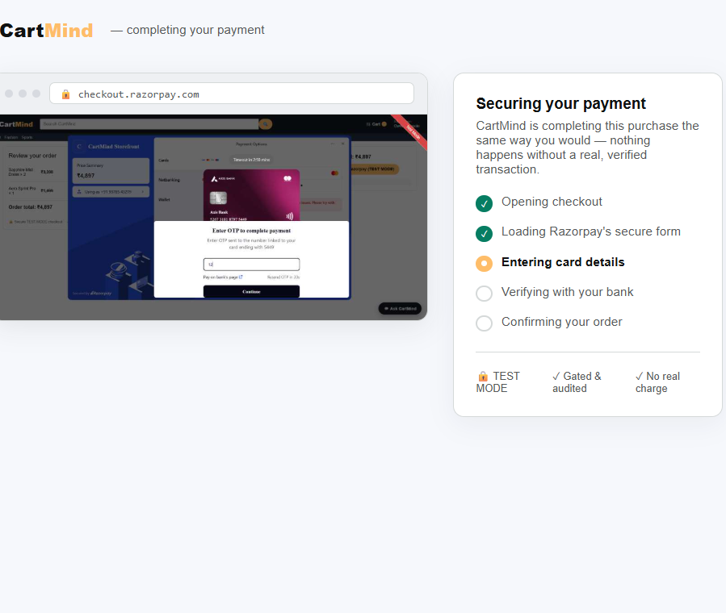
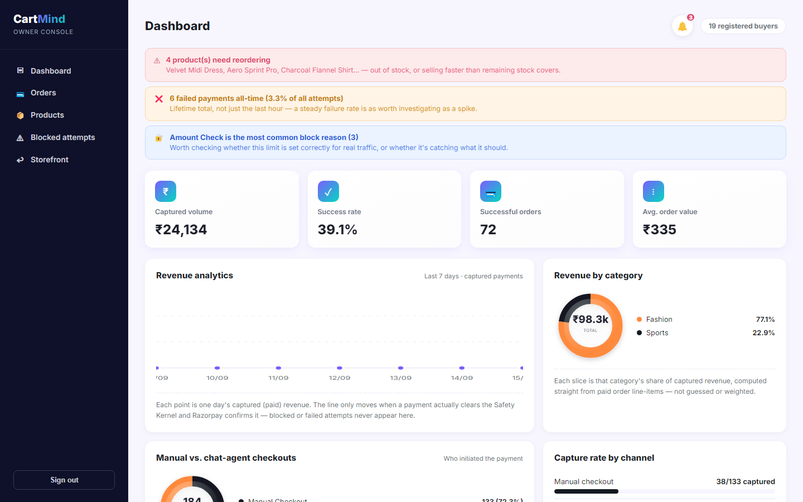

# CartMind

CartMind is a demo of an AI shopping agent with a bounded, gated, and
auditable payment flow, built on a real Flask storefront. Two ways to drive
it:

1. **In-page chat widget** (💬 Ask CartMind, bottom-right of the storefront)
   — talk or type to search, add to cart, check out, and pay, all from
   inside the site itself. No login required (checkout auto-provisions a
   guest account). Supports voice input (mic button, transcribed with Groq
   Whisper). When you hand over a card, it opens a dedicated **live payment
   view** in the same tab — a real CDP screencast of the automation typing
   your card into the actual Razorpay iframe, streamed over a WebSocket, so
   you watch it happen even on a headless hosted deployment (see
   [Screenshots](#screenshots) below).
2. **Local browser agent** (`agent/`) — a separate CLI/conversational loop
   that opens its own real Chromium window and **types a TEST MODE card
   into the actual Razorpay Checkout iframe live**, character by character,
   for a fully visible local demo outside the storefront.

Underneath both sits a policy core — `mandate.py`, `gating.py`,
`safety_kernel.py`, `database.py` — so a payment can only happen after
explicit confirmation, under a hard order-value cap, with every step
(allowed or blocked) written to an auditable trail.

📐 **[Design doc](DESIGN.md)** — full system architecture (HLD/LLD), sequence diagrams, security model, known limitations, and business impact.

## Screenshots

| | |
|---|---|
| **Search / catalog** | **Product page** |
|  |  |
| **Cart** | **Checkout** |
|  |  |
| **Order confirmed** | **Order failed** |
|  |  |

**Chat widget** — search, add-to-cart, and checkout narrated conversationally:



**Live payment view** — a real CDP screencast of the automation typing the card into Razorpay's actual OTP-secured checkout, streamed live over a WebSocket, with a step checklist tracking progress:



**Owner console** — revenue, funnel, manual-vs-agent split, and the full payment ledger, computed live from the audit trail:



## Design notes

The project borrows the AP2 idea of separate intent, cart, and payment
steps, kept intentionally simplified for a demo. Each step is a structured
object instead of a cryptographically signed VC. `gating.py` enforces:

- a hard maximum order value (mandate-level / Safety Kernel default)
- blocked categories such as accessories
- a requirement that no payment can be attempted without explicit prior
  user confirmation against the active cart
- a timestamped audit trail (`render_trail()` / `GET /trail`)

`safety_kernel.py` adds a second, independent gate in front of every
money-moving write: authorization match, recalculated-amount match,
transaction limit, quantity limit, discount limit, rate limit, and
duplicate check — all seven pass/fail with a plain-English reason.

Every checkout is tagged `manual` or `agent` (whichever completed it), and
the owner console (`/owner`) breaks down revenue, funnel, and channel split
from that data — nothing there is guessed or hardcoded.

## How the in-page chat actually pays

Razorpay's card fields render inside a cross-origin iframe for PCI
compliance — page JavaScript can never read or fill them directly, on any
site. So when you give the chat a card, the server drives a real Playwright
browser server-side (`storefront/app.py`'s `_run_test_payment`) that opens
the checkout page and types into that iframe like a person would, then
returns the real result (`captured`/`failed`) to the chat.

- **Locally**, running `python storefront/app.py` also launches your own
  Chrome with remote debugging enabled (`_launch_debug_browser`), so the
  automation attaches to and types in **your own already-open browser tab**
  instead of a separate process. If no such browser is reachable, it falls
  back to a fresh, maximized Chromium window.
- **On a hosted server** (Render, etc. — detected via the `RENDER` env var,
  or set `CARTMIND_FORCE_HEADLESS=1` yourself), there's no local desktop to
  attach to, so it always runs its own headless server-side browser instead.

Either way, giving the chat a card navigates that same tab to a dedicated
**live payment view** (`/live-view/<stream_id>`), which opens a WebSocket to
`/ws/payment-stream/<id>` and renders a live CDP screencast (`Page.startScreencast`)
of the automation actually typing into Razorpay's real iframe — a "browser
window" mockup with a step checklist, not a raw video feed, so it reads as
part of the site rather than a screen recording. This is what makes the
typing **visible even on a fully headless hosted deployment**, not just
locally. When the payment resolves, the server pushes a final result over
that same socket, the live-view page redirects to the real
`/order-confirmed` or `/order-failed` (with the actual order id/amount or
failure reason — never a guess), and patches the chat widget's own stored
history so reopening it shows the real outcome instead of being stuck on
"Thinking…".

## Files

**Shared core**
- `catalog.json` — merchant catalog with real product images
  (`storefront/static/images/`)
- `catalog_service.py` / `cart_service.py` — catalog search/rank and
  in-memory cart used by `test_pipeline.py`
- `mandate.py` — AP2-inspired mandate dataclasses (intent / cart / payment)
- `gating.py` — cart-level policy checks and audit trail
- `safety_kernel.py` — seven-check deterministic gate for every payment
- `razorpay_service.py` — Razorpay SDK wrapper with a local simulator
  fallback when no `rzp_test_...` keys are configured
- `database.py` — SQLite (local) / Neon Postgres (`DATABASE_URL`) audit
  trail, payments, and user accounts
- `test_pipeline.py` — end-to-end scenarios with assertions (happy path,
  blocked category, forced decline)

**Storefront**
- `storefront/app.py` — Flask storefront: search / product / cart /
  checkout / order-confirmed / order-failed / owner console / the
  `/agent/chat` and `/agent/transcribe` endpoints behind the chat widget,
  plus the `/ws/payment-stream/<id>` WebSocket (flask-sock) that relays the
  live CDP screencast to the live payment view
- `storefront/templates/`, `storefront/static/` — storefront pages and the
  chat widget's JS/CSS (`templates/base.html`), plus product images;
  `templates/live_view.html` is the standalone live payment view page
- `agent/browser_agent.py` — Playwright wrapper (`BrowserAgent` class) plus
  the module-level, hardened `pay_with_card()` shared by the storefront's
  server-side automation, `agent.py`, and `cli.py`: handles Razorpay's
  contact-details overlay, an RBI "save card" prompt, OTP polling, and
  verifies every typed field actually landed (retyping if the iframe
  dropped characters mid-type)

**Local browser agent (optional, separate from the in-page chat)**
- `agent/agent.py` — conversational loop (Groq, tool-calling) driving a
  **visible** Chromium window on the real storefront; supports typed input
  and voice input (`voice`/`v`/`mic`, records via `sounddevice`)
- `agent/cli.py` — single-shot CLI driver for the same actions
  (`search` / `add-to-cart` / `checkout` / `pay` / `reset`), session
  persisted across separate calls via Playwright `storage_state`,
  screenshots itself after every action to `agent/last_screenshot.png`

**Reference**
- `TEST_CARDS.md` — Razorpay TEST MODE cards known to work here, plus
  gotchas (see below)
- `.claude/skills/cartmind-agent/SKILL.md` — lets Claude Code drive
  `agent/cli.py` when asked to "use the cartmind agent"

## Install (local)

```bash
cd cartmind
python -m pip install -r requirements.txt
python -m playwright install chromium
```

## Run locally

```bash
cd cartmind
python storefront/app.py
```

This starts the storefront at `http://127.0.0.1:5000/search` and (on
Windows, with Chrome/Edge installed) opens your own browser pointed at it
with remote debugging enabled, so the chat's payment automation types
visibly into that same window. Open the 💬 **Ask CartMind** widget and try:

```
I want a dress
add the Velvet Midi Dress to my cart
checkout
card number 5267318187975449, expiry 12/28, cvv 123
```

No sign-up needed — checkout auto-provisions a guest account. Try the mic
button for voice input.

### Optional: the standalone local agent

```bash
python agent/agent.py           # conversational loop, its own browser window
# or
python agent/cli.py search "dress" --color black
python agent/cli.py add-to-cart DRESS-106
python agent/cli.py checkout
python agent/cli.py pay 5267318187975449 12/28 123
python agent/cli.py reset       # clear the session/cart to start over
```

## Test-mode payments

See `TEST_CARDS.md` for the full list, and two non-obvious gotchas found
while building this:

- `4111 1111 1111 1111` (the generic, famous test Visa) gets rejected by
  Razorpay India's TEST MODE as an "international card" — use the domestic
  cards in `TEST_CARDS.md` instead (default: `5267 3181 8797 5449`).
- The phone number `9876543210` specifically fails Razorpay's contact-step
  validation (looks filled in, isn't) — use `9876543219` instead.

Both are already wired as defaults in the chat, `agent/agent.py`, and
`agent/cli.py`.

## Run the pipeline / tests

```bash
cd cartmind
python test_pipeline.py
```

## Environment

```
RAZORPAY_KEY_ID=rzp_test_...
RAZORPAY_KEY_SECRET=...
GROQ_API_KEY=gsk_...                # chat LLM + voice transcription
DATABASE_URL=postgresql://...       # optional — Neon Postgres; blank = local SQLite
STOREFRONT_SECRET=...               # Flask session signing key
OWNER_PASSWORD=owner123             # /owner console login
MAX_AI_TRANSACTION=3000
MAX_AI_QUANTITY=3
CARTMIND_FORCE_HEADLESS=1           # force headless payment automation (set automatically on Render)
CARTMIND_CDP_URL=http://127.0.0.1:9222  # optional override for local CDP-attach
```

Live Razorpay keys (`rzp_live_...`) are rejected everywhere in this repo —
TEST MODE only.

## Deploying to Render

This repo includes a `Dockerfile` (based on Playwright's official image, so
Chromium's OS-level dependencies are already present — more reliable than
relying on a native build sandbox's `apt-get`) and a `render.yaml`.

1. Push this repo to GitHub.
2. In Render: **New → Blueprint**, point it at the repo — `render.yaml`
   defines the service automatically.
3. Fill in the secret env vars Render prompts for: `GROQ_API_KEY`,
   `RAZORPAY_KEY_ID`, `RAZORPAY_KEY_SECRET`, `DATABASE_URL`,
   `OWNER_PASSWORD`. (`STOREFRONT_SECRET` is auto-generated;
   `CARTMIND_FORCE_HEADLESS` is already set.)
4. Deploy. Gunicorn is configured with `--worker-class gevent` (required for
   the `/ws/payment-stream/<id>` WebSocket to actually upgrade at all — sync
   workers can't hijack the socket the way flask-sock needs) and a 120s
   worker timeout — real payment automation (remote DB round-trips + a live
   Razorpay order + typing into the iframe) can take 30-90s, which is
   normal, not a hang.

Without a Blueprint, the equivalent manual setup is: **New → Web Service →
Docker**, same repo, same env vars.

## AI-buyer transaction story

1. The AI buyer hears or receives a request such as "find a dress under
   ₹3,000".
2. CartMind searches the catalog and produces a quote with item, price, and
   constraints, narrowing conversationally on follow-ups ("black ones").
3. The buyer reviews the quote and explicitly confirms it, then supplies
   card details.
4. The server authenticates to Razorpay with `rzp_test_` credentials,
   creates (or reuses) the order, drives the real Checkout iframe, and
   records intent → confirmation → authentication → order → processing
   events in the database.
5. `/trail` and `/owner` show the transaction and its audit trail; the
   buyer lands on `/order-confirmed` with a real order summary.
