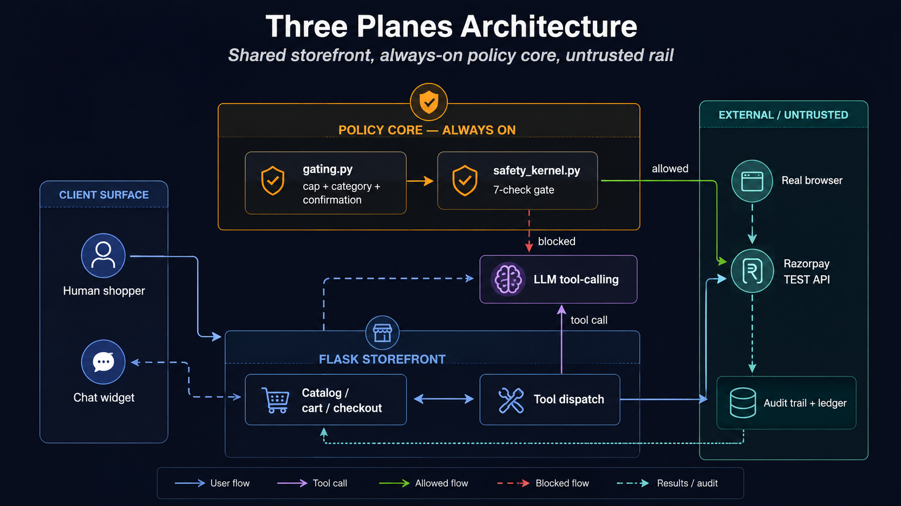
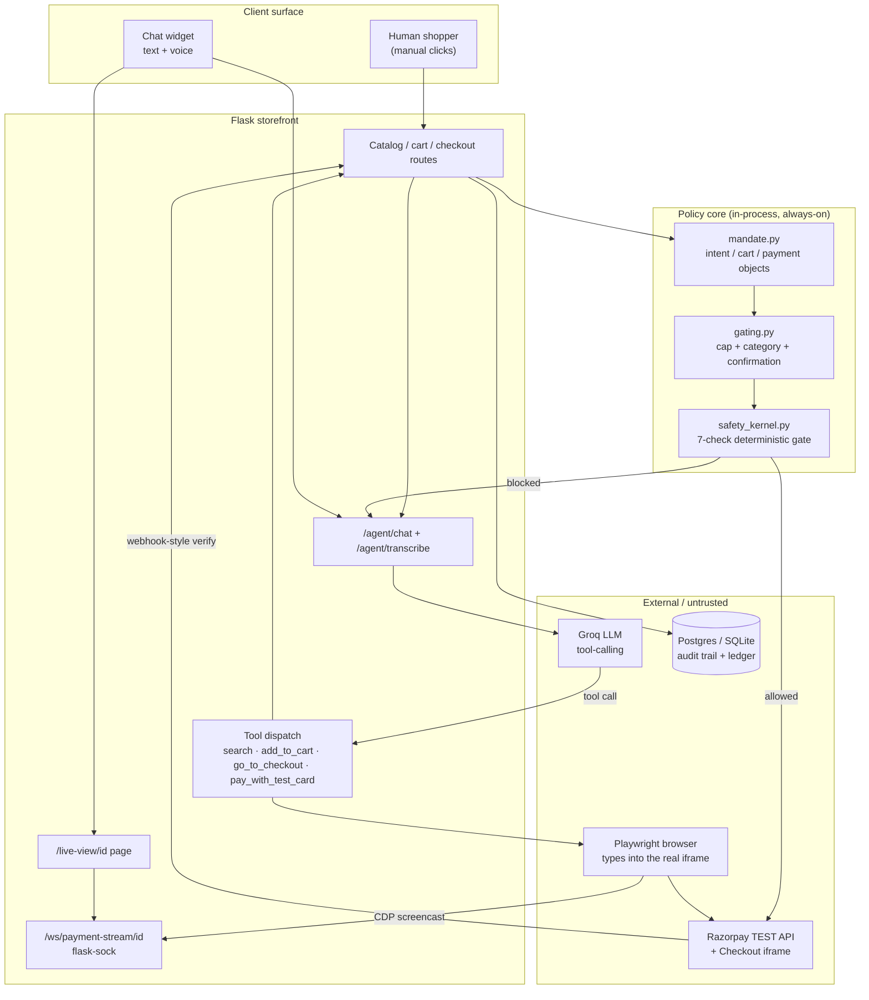
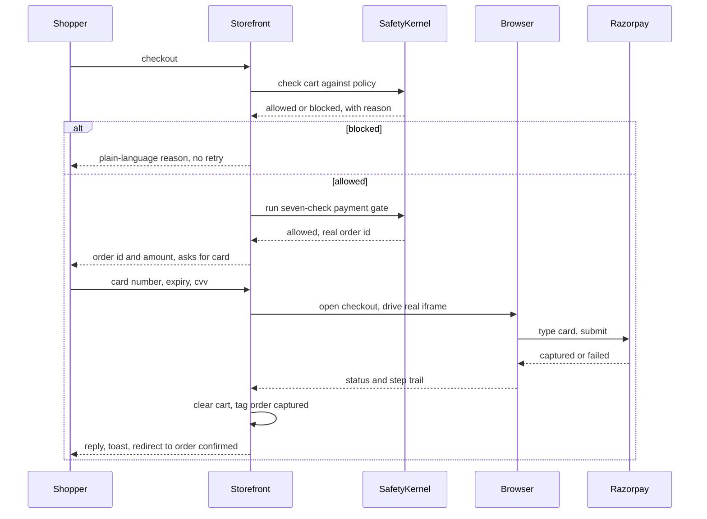

# CartMind

CartMind is a demo of an AI shopping agent with a bounded, gated, and
auditable payment flow, built on a real Flask storefront. Two ways to drive
it:

1. **In-page chat widget** (💬 Ask CartMind, bottom-right of the storefront)
   — talk or type to search, add to cart, check out, and pay, all from
   inside the site itself. No login required (checkout auto-provisions a
   guest account). Supports voice input (mic button, transcribed with Groq
   Whisper). When you hand over a card, it opens a dedicated **live payment
   view** in the same tab — a real CDP screencast of the automation typing
   your card into the actual Razorpay iframe, streamed over a WebSocket, so
   you watch it happen even on a headless hosted deployment (see
   [Screenshots](#screenshots) below).
2. **Local browser agent** (`agent/`) — a separate CLI/conversational loop
   that opens its own real Chromium window and **types a TEST MODE card
   into the actual Razorpay Checkout iframe live**, character by character,
   for a fully visible local demo outside the storefront.

Underneath both sits a policy core — `mandate.py`, `gating.py`,
`safety_kernel.py`, `database.py` — so a payment can only happen after
explicit confirmation, under a hard order-value cap, with every step
(allowed or blocked) written to an auditable trail.

📐 Full system architecture (HLD/LLD), sequence diagrams, security model, known limitations, and business impact — see [Architecture & Design](#architecture--design) below.

## Live demo

**[cartmind-vw0v.onrender.com](https://cartmind-vw0v.onrender.com)** — hosted on Render, running the same headless payment automation described below. Owner console: `/owner`, password `owner123`.

## Screenshots

| | |
|---|---|
| **Search / catalog** | **Product page** |
|  |  |
| **Cart** | **Checkout** |
|  |  |
| **Order confirmed** | **Order failed** |
|  |  |

**Chat widget** — search, add-to-cart, and checkout narrated conversationally:


**Live payment view** — a real CDP screencast of the automation typing the card into Razorpay's actual OTP-secured checkout, streamed live over a WebSocket, with a step checklist tracking progress:


**Owner console** — revenue, funnel, manual-vs-agent split, and the full payment ledger, computed live from the audit trail:


## Architecture & Design

*Razorpay TEST MODE only · no path in this repository can move real money.*

### Purpose & problem statement

Agentic commerce needs a demonstrable answer to one question: can an AI be
trusted to spend money on a person's behalf, and can every decision it made
be reconstructed afterward?

- Conversational commerce is moving from "recommend" to "transact" — an
  agent that can search, decide, and pay changes the trust surface of a
  storefront.
- CartMind is a reference implementation of the guardrails that make that
  surface acceptable: hard spend caps, category blocks, explicit
  confirmation, and a seven-check gate in front of every money-moving write.
- It exists to answer three questions concretely, not hypothetically: what
  can the agent do unsupervised, what can it never do, and how would an
  auditor prove that after the fact.
- The build borrows AP2's separation of intent / cart / payment mandates,
  simplified to plain structured objects for a demo rather than signed
  verifiable credentials.

### High-level design

Three planes: a storefront the agent and a human share, a policy core
neither can bypass, and an external payment rail treated as untrusted until
verified.



*Fig. 1 — Component view. The policy core sits between every route and Razorpay; the agent has no path that skips it. `Allowed`/`blocked` flows out of the safety kernel are the two only ways a tool call can end.*

<details>
<summary>Fig. 1b — textual/mermaid version, including the live payment view (not pictured above)</summary>



</details>

**Design decisions**

- **Single storefront, two front doors.** A human clicking buttons and an
  LLM calling tools both terminate in the same Flask routes and the same
  gating code — there is deliberately no separate "agent API" with looser
  rules.
- **The LLM never touches money directly.** It can only request a named
  tool call; the server decides whether that call is allowed to run,
  independent of what the model claims.
- **Payment automation is a browser, not an API shortcut.** Razorpay's card
  fields live in a cross-origin iframe by design (PCI scope); the agent
  drives a real Playwright browser rather than being handed a way around
  that isolation.
- **Every checkout is channel-tagged** (`manual` / `agent`) at creation
  time, so the owner console's split is measured, not inferred.

### Low-level design

**Conversational tool loop** — each chat turn runs a bounded loop (max 4
rounds) against the LLM with a fixed tool schema. The model chooses zero or
more tools per round; the server executes them and feeds results back
before the next round.

- `search_catalog` → free-text + color/type/price filter over the catalog.
- `view_product` → forces a product-page view before `add_to_cart`.
- `go_to_checkout` → runs the full gate and returns `blocked`/`allowed`
  plus the real order id — never a guess.
- `pay_with_test_card` → the only tool that can move money; requires card
  details already present in the conversation, never silently defaulted.

> **Reliability note** — Smaller/rate-limited models occasionally narrate a fake success without calling the payment tool. The server treats the model as untrusted here too: a regex detects card-like input or a bare confirmation after a proposed card, forces `tool_choice` to the payment tool, and overwrites any reply claiming success if the tool was never actually invoked that turn.



*Fig. 2 — A blocked cart never reaches Razorpay; a captured payment always reuses the order id already shown to the user.*

**Order-identity guarantee** — an earlier revision created a fresh Razorpay
order on every `/checkout` load, including the automation's own internal
reload before typing the card — so the order id shown to the shopper could
silently diverge from the one actually charged. Fixed by reusing any
existing `status="created"` order for the same user + amount, refreshing
its stored item snapshot on reuse so catalog changes (e.g. images) don't
freeze stale.

### Data model

One append-friendly events table for narration, one payments table as the ledger of record.

| Table | Key columns | Purpose |
|---|---|---|
| `audit_events` | `event_type, action, status, amount_inr, details_json` | Timestamped narration of every gate decision — allowed or blocked, with the plain-English reason |
| `payments` | `order_id, status, amount_inr, channel, transaction_id, user_id` | Ledger of record; `status` transitions created → captured/failed; `channel` is manual/agent |
| `users` | `email, password_hash, name` | Includes an auto-provisioned guest account so checkout never hard-requires signup |

Postgres (Neon) in production, SQLite locally, selected purely by whether `DATABASE_URL` is set — no code branches on environment beyond that.

### Security model

> **Enforced today**
> - **Iframe isolation is load-bearing, not incidental.** Razorpay's card fields are never reachable from page or agent JavaScript — the only way to fill them is real OS-level input via Playwright, which is also why a card can never be silently auto-submitted by a hallucinating model without a real browser action happening.
> - **Two independent gates, not one.** `gating.py`'s cart-level policy and `safety_kernel.py`'s seven-check payment gate are separate code paths; a bug in one doesn't disable the other.
> - **Seven checks, each falsifiable in isolation:** authorization match, recalculated-amount match, transaction limit, quantity limit, discount limit, rate limit, duplicate-payment check — every pass/fail carries a plain-English reason into the audit trail.
> - **No implicit spend.** `pay_with_test_card` requires card details already present in the conversation this turn; the system prompt and a server-side forced-tool-call check both refuse to default to a stored card silently.
> - **TEST MODE is structurally enforced.** `razorpay_service.py` rejects `rzp_live_` keys outright — there is no code path in this repo that can move real money.

**Threat notes specific to an LLM-driven checkout**

- **Prompt injection via product data.** Catalog text (names, descriptions) flows into the model's context; nothing in it is currently sanitized against instruction-like content. Low blast radius today because the model still can't call the payment tool without a real card appearing in the conversation.
- **Model narration vs. ground truth.** The model's own claims are never trusted for anything money-related — the server verifies tool calls happened and reads results from real HTTP responses, not from the model's prose.
- **Session-cookie handoff to automation.** The Playwright browser is handed the requester's session cookie so it acts as that user; this is safe within a single trusted server process but would need scoping (short-lived, single-use tokens) before this pattern is exposed multi-tenant.

### Limitations

> **Known, accepted for a demo**
> - **External-service latency is unbudgeted risk.** A single `/checkout` load has been observed taking 15-20s (sequential Postgres round-trips + a live Razorpay order call); the full pay flow can run 50-90s. Timeouts are widened to absorb this, not to fix its cause.
> - **No connection pooling.** `database.py` opens a fresh Postgres connection per call; every extra audit-event write is another network round trip.
> - **Small/rate-limited LLMs are measurably less reliable** at the multi-step tool sequence checkout requires — mitigated with forced tool-choice and reply-overriding safeguards, not eliminated.
> - **No rate limiting or bot defense** on `/agent/chat` itself — the seven-check gate limits blast radius per transaction, not request volume.
> - **Guest-account checkout** means auditability is per-session, not per-verified-identity — acceptable for a demo, not for a real deployment.
> - **The live payment stream is unauthenticated by stream id alone.** Anyone who learns a `stream_id` (a client-generated UUID) can open `/ws/payment-stream/<id>` and watch those frames — low risk today since it's a random per-session value carrying no card data server-side, but it isn't scoped to the session that created it.

### Impact

> **What this demonstrates**
> - **A concrete trust boundary for agentic spend.** Rather than arguing in the abstract that an AI agent "can be made safe," CartMind shows the exact mechanism: a deterministic, falsifiable gate the agent cannot talk its way around.
> - **Auditability as a first-class output, not an afterthought.** Every blocked attempt and every captured payment is reconstructable from `/trail` and the owner console — the same data a real compliance review would ask for.
> - **A reusable pattern, not a one-off script.** The gating/kernel/mandate split is portable to any storefront; the browser-automation layer is portable to any PCI-scoped checkout that similarly isolates card entry in an iframe.
> - **Operational visibility a business would actually use.** The owner console's manual-vs-agent split, funnel, and blocked-attempt ledger turn "is the agent behaving" from a qualitative worry into three numbers on a dashboard.

| Metric surfaced | Where | Why it matters |
|---|---|---|
| Checkout funnel (attempts → cart-policy → kernel → captured) | Owner console | Shows exactly which gate is rejecting traffic, not just a pass/fail total |
| Manual vs. agent capture rate | Owner console | Confirms the agent is held to the same bar as a human, not a looser one |
| Blocked-attempt ledger with reason | Owner console + `/trail` | Turns "the agent tried something risky" into a reviewable, timestamped record |

### Hardening roadmap

In priority order, if this moved from demo toward production:

1. Connection pooling for the audit/payments database — removes the single largest source of unbudgeted latency.
2. Real user authentication in place of guest-account checkout, so audit records tie to a verified identity.
3. Sanitize catalog text reaching the LLM's context; treat product data as untrusted input, not trusted system content.
4. Short-lived, single-purpose session tokens for the automation handoff, scoped narrower than the user's full session cookie.
5. Rate limiting and anomaly detection on `/agent/chat` independent of the per-transaction safety kernel.
6. Scope `/ws/payment-stream/<id>` to the session that created it, instead of trusting possession of the id alone.

## Design notes

The project borrows the AP2 idea of separate intent, cart, and payment
steps, kept intentionally simplified for a demo. Each step is a structured
object instead of a cryptographically signed VC. `gating.py` enforces:

- a hard maximum order value (mandate-level / Safety Kernel default)
- blocked categories such as accessories
- a requirement that no payment can be attempted without explicit prior
  user confirmation against the active cart
- a timestamped audit trail (`render_trail()` / `GET /trail`)

`safety_kernel.py` adds a second, independent gate in front of every
money-moving write: authorization match, recalculated-amount match,
transaction limit, quantity limit, discount limit, rate limit, and
duplicate check — all seven pass/fail with a plain-English reason.

Every checkout is tagged `manual` or `agent` (whichever completed it), and
the owner console (`/owner`) breaks down revenue, funnel, and channel split
from that data — nothing there is guessed or hardcoded.

## How the in-page chat actually pays

Razorpay's card fields render inside a cross-origin iframe for PCI
compliance — page JavaScript can never read or fill them directly, on any
site. So when you give the chat a card, the server drives a real Playwright
browser server-side (`storefront/app.py`'s `_run_test_payment`) that opens
the checkout page and types into that iframe like a person would, then
returns the real result (`captured`/`failed`) to the chat.

- **Locally**, running `python storefront/app.py` also launches your own
  Chrome with remote debugging enabled (`_launch_debug_browser`), so the
  automation attaches to and types in **your own already-open browser tab**
  instead of a separate process. If no such browser is reachable, it falls
  back to a fresh, maximized Chromium window.
- **On a hosted server** (Render, etc. — detected via the `RENDER` env var,
  or set `CARTMIND_FORCE_HEADLESS=1` yourself), there's no local desktop to
  attach to, so it always runs its own headless server-side browser instead.

Either way, giving the chat a card navigates that same tab to a dedicated
**live payment view** (`/live-view/<stream_id>`), which opens a WebSocket to
`/ws/payment-stream/<id>` and renders a live CDP screencast (`Page.startScreencast`)
of the automation actually typing into Razorpay's real iframe — a "browser
window" mockup with a step checklist, not a raw video feed, so it reads as
part of the site rather than a screen recording. This is what makes the
typing **visible even on a fully headless hosted deployment**, not just
locally. When the payment resolves, the server pushes a final result over
that same socket, the live-view page redirects to the real
`/order-confirmed` or `/order-failed` (with the actual order id/amount or
failure reason — never a guess), and patches the chat widget's own stored
history so reopening it shows the real outcome instead of being stuck on
"Thinking…".

Confirmed end-to-end on a real headless Render deployment — getting there
took six separate, compounding fixes for things that only ever surface in a
container. Each one masked the next, only found by adding step-by-step
logging to the actual automation and reading real production logs:

| # | Symptom | Root cause | Fix |
|---|---|---|---|
| 1 | Browser launch hung forever, no error | Chromium's sandbox needs privileges the container doesn't grant; `/dev/shm` too small | `--no-sandbox --disable-dev-shm-usage` |
| 2 | `Executable doesn't exist` at launch | `playwright` pip package version drifted ahead of the Docker base image's bundled Chromium build | Pin `playwright==1.49.0` to match the base image exactly |
| 3 | `Playwright Sync API inside the asyncio loop` | gunicorn's `gevent` worker monkey-patches the whole process, which Playwright's sync API misreads as a running event loop | Switched gunicorn to `gthread` workers — real OS threads, no monkey-patching |
| 4 | Modal never rendered, no exception | Razorpay's own bot/fraud detection silently refusing headless traffic (`navigator.webdriver`, a `HeadlessChrome` user-agent string) | `--headless=new` + `--disable-blink-features=AutomationControlled`, a realistic desktop user-agent, and an init script forcing `navigator.webdriver` to `undefined` |
| 5 | Pay button click always failed, "intercepted" | Razorpay's own background prefetch iframe sat on top of the button before the modal opened | Reused the existing `safe_click()` helper (Escape, then a forced click) instead of a plain `page.click()` |
| 6 | Card fields never got typed into (only the phone number landed) | Headless Chromium's default window is small; Razorpay renders its mobile "Payment Options" accordion instead of the desktop form | Forced a real desktop `viewport` (1440×900) on the headless context instead of `no_viewport=True` |

## Files

**Shared core**
- `catalog.json` — merchant catalog with real product images
  (`storefront/static/images/`)
- `catalog_service.py` / `cart_service.py` — catalog search/rank and
  in-memory cart used by `test_pipeline.py`
- `mandate.py` — AP2-inspired mandate dataclasses (intent / cart / payment)
- `gating.py` — cart-level policy checks and audit trail
- `safety_kernel.py` — seven-check deterministic gate for every payment
- `razorpay_service.py` — Razorpay SDK wrapper with a local simulator
  fallback when no `rzp_test_...` keys are configured
- `database.py` — SQLite (local) / Neon Postgres (`DATABASE_URL`) audit
  trail, payments, and user accounts
- `test_pipeline.py` — end-to-end scenarios with assertions (happy path,
  blocked category, forced decline)

**Storefront**
- `storefront/app.py` — Flask storefront: search / product / cart /
  checkout / order-confirmed / order-failed / owner console / the
  `/agent/chat` and `/agent/transcribe` endpoints behind the chat widget,
  plus the `/ws/payment-stream/<id>` WebSocket (flask-sock) that relays the
  live CDP screencast to the live payment view
- `storefront/templates/`, `storefront/static/` — storefront pages and the
  chat widget's JS/CSS (`templates/base.html`), plus product images;
  `templates/live_view.html` is the standalone live payment view page
- `agent/browser_agent.py` — Playwright wrapper (`BrowserAgent` class) plus
  the module-level, hardened `pay_with_card()` shared by the storefront's
  server-side automation, `agent.py`, and `cli.py`: handles Razorpay's
  contact-details overlay, an RBI "save card" prompt, OTP polling, and
  verifies every typed field actually landed (retyping if the iframe
  dropped characters mid-type)

**Local browser agent (optional, separate from the in-page chat)**
- `agent/agent.py` — conversational loop (Groq, tool-calling) driving a
  **visible** Chromium window on the real storefront; supports typed input
  and voice input (`voice`/`v`/`mic`, records via `sounddevice`)
- `agent/cli.py` — single-shot CLI driver for the same actions
  (`search` / `add-to-cart` / `checkout` / `pay` / `reset`), session
  persisted across separate calls via Playwright `storage_state`,
  screenshots itself after every action to `agent/last_screenshot.png`

**Reference**
- `TEST_CARDS.md` — Razorpay TEST MODE cards known to work here, plus
  gotchas (see below)
- `.claude/skills/cartmind-agent/SKILL.md` — lets Claude Code drive
  `agent/cli.py` when asked to "use the cartmind agent"

## Install (local)

```bash
cd cartmind
python -m pip install -r requirements.txt
python -m playwright install chromium
```

## Run locally

```bash
cd cartmind
python storefront/app.py
```

This starts the storefront at `http://127.0.0.1:5000/search` and (on
Windows, with Chrome/Edge installed) opens your own browser pointed at it
with remote debugging enabled, so the chat's payment automation types
visibly into that same window. Open the 💬 **Ask CartMind** widget and try:

```
I want a dress
add the Velvet Midi Dress to my cart
checkout
card number 5267318187975449, expiry 12/28, cvv 123
```

No sign-up needed — checkout auto-provisions a guest account. Try the mic
button for voice input.

### Optional: the standalone local agent

```bash
python agent/agent.py           # conversational loop, its own browser window
# or
python agent/cli.py search "dress" --color black
python agent/cli.py add-to-cart DRESS-106
python agent/cli.py checkout
python agent/cli.py pay 5267318187975449 12/28 123
python agent/cli.py reset       # clear the session/cart to start over
```

## Test-mode payments

See `TEST_CARDS.md` for the full list, and two non-obvious gotchas found
while building this:

- `4111 1111 1111 1111` (the generic, famous test Visa) gets rejected by
  Razorpay India's TEST MODE as an "international card" — use the domestic
  cards in `TEST_CARDS.md` instead (default: `5267 3181 8797 5449`).
- The phone number `9876543210` specifically fails Razorpay's contact-step
  validation (looks filled in, isn't) — use `9876543219` instead.

Both are already wired as defaults in the chat, `agent/agent.py`, and
`agent/cli.py`.

## Run the pipeline / tests

```bash
cd cartmind
python test_pipeline.py
```

## Environment

```
RAZORPAY_KEY_ID=rzp_test_...
RAZORPAY_KEY_SECRET=...
GROQ_API_KEY=gsk_...                # chat LLM + voice transcription
DATABASE_URL=postgresql://...       # optional — Neon Postgres; blank = local SQLite
STOREFRONT_SECRET=...               # Flask session signing key
OWNER_PASSWORD=owner123             # /owner console login
MAX_AI_TRANSACTION=3000
MAX_AI_QUANTITY=3
CARTMIND_FORCE_HEADLESS=1           # force headless payment automation (set automatically on Render)
CARTMIND_CDP_URL=http://127.0.0.1:9222  # optional override for local CDP-attach
```

Live Razorpay keys (`rzp_live_...`) are rejected everywhere in this repo —
TEST MODE only.

## Deploying to Render

This repo includes a `Dockerfile` (based on Playwright's official image, so
Chromium's OS-level dependencies are already present — more reliable than
relying on a native build sandbox's `apt-get`) and a `render.yaml`.

1. Push this repo to GitHub.
2. In Render: **New → Blueprint**, point it at the repo — `render.yaml`
   defines the service automatically.
3. Fill in the secret env vars Render prompts for: `GROQ_API_KEY`,
   `RAZORPAY_KEY_ID`, `RAZORPAY_KEY_SECRET`, `DATABASE_URL`,
   `OWNER_PASSWORD`. (`STOREFRONT_SECRET` is auto-generated;
   `CARTMIND_FORCE_HEADLESS` is already set.)
4. Deploy. Gunicorn is configured with `--worker-class gthread --threads 8`
   (real OS threads, needed both for the `/ws/payment-stream/<id>` WebSocket
   to upgrade and for Playwright's sync API to work at all — the `gevent`
   worker class monkey-patches the whole process, which makes Playwright
   misdetect a running asyncio loop and refuse to launch the browser), a
   120s worker timeout (real payment automation — remote DB round-trips + a
   live Razorpay order + typing into the iframe — can take 30-90s, which is
   normal, not a hang), and `--access-logfile - --error-logfile -` so
   request/error logs actually reach Render's log stream instead of being
   silently dropped.

Without a Blueprint, the equivalent manual setup is: **New → Web Service →
Docker**, same repo, same env vars.

## AI-buyer transaction story

1. The AI buyer hears or receives a request such as "find a dress under
   ₹3,000".
2. CartMind searches the catalog and produces a quote with item, price, and
   constraints, narrowing conversationally on follow-ups ("black ones").
3. The buyer reviews the quote and explicitly confirms it, then supplies
   card details.
4. The server authenticates to Razorpay with `rzp_test_` credentials,
   creates (or reuses) the order, drives the real Checkout iframe, and
   records intent → confirmation → authentication → order → processing
   events in the database.
5. `/trail` and `/owner` show the transaction and its audit trail; the
   buyer lands on `/order-confirmed` with a real order summary.
